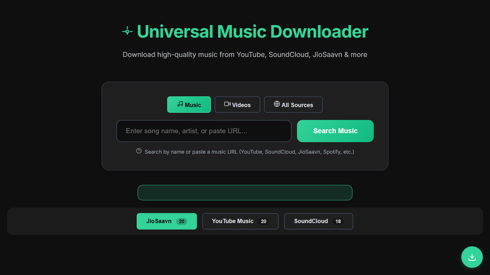

# Universal Music Downloader



A powerful web-based music downloader that searches and downloads music from multiple sources including YouTube Music, JioSaavn, and SoundCloud.

[](https://heroku.com/deploy)

## Features

- **Multi-Source Search**: Search across YouTube Music, YouTube Videos, JioSaavn, and SoundCloud simultaneously
- **Web Interface**: Clean, modern web interface with real-time search results
- **Advanced Download Options**: Customizable audio quality, format selection, and metadata embedding
- **URL Support**: Direct download from supported platform URLs
- **Background Processing**: Non-blocking downloads with queue management
- **MetaData Embed**: adds metadata to file the music file regardless of format

## Supported Platforms

- YouTube Music
- YouTube Videos
- JioSaavn
- SoundCloud
- Spotify

### Prerequisites

- **Python 3.12 (recommended)**
- **Node.js 18+** and npm
- **yt-dlp**
- **ffmpeg**
- **fpcalc** (optional, for Picard/AcoustID fallback)

### Setup

1. Clone or download the project files

   ```bash
   git clone https://github.com/crazyscriptright/Songs_Downloder.git
   ```

2. Set up backend:

   ```bash
   cd backend
   python -m venv venv
   # Windows
   venv\Scripts\activate
   # macOS/Linux
   # source venv/bin/activate
   pip install -r requirements.txt
   ```

3. Set up frontend:

   ```bash
   cd ../spotiflac-frontend
   npm install
   ```

4. Create environment file:

   ```bash
   # from repo root
   copy backend\.env.example backend\.env
   # or on macOS/Linux: cp backend/env.example backend/.env
   ```

5. (Optional) Configure frontend API URL:

   ```bash
   # from repo root
   copy spotiflac-frontend\.env.example spotiflac-frontend\.env.local
   # or on macOS/Linux: cp spotiflac-frontend/.env.example spotiflac-frontend/.env.local
   ```

### Configuration

Configure these in `backend/.env`:

- `SECRET_KEY`
- `FLASK_ENV`
- `PORT`
- `FRONTEND_URL`
- `FORCE_PROXY_API`
- `VIDEO_DOWNLOAD_API_KEY` (optional)
- `ACOUSTID_API_KEY` (optional)

Frontend environment (optional):

- `spotiflac-frontend/.env.local`
- `VITE_API_URL` (e.g. `http://localhost:5000`)

## Usage

### Starting the Server

Run backend:

```bash
cd backend
venv\Scripts\activate
python app.py
```

Run frontend (new terminal):

```bash
cd spotiflac-frontend
npm run dev
```

Backend starts on `http://localhost:5000` (or `PORT`), frontend on `http://localhost:5173`.

### Web Interface

1. **Search**: Enter song name, artist, or direct URL
2. **Select Source**: Choose between Music, Video, or All sources
3. **Browse Results**: View results from all sources with thumbnails and metadata
4. **Download**: Click download button and optionally configure advanced settings
5. **Monitor Progress**: Track download progress in real-time
6. **Manage Downloads**: Cancel, clear, or download completed files

### Advanced Download Options

- **Audio Format**: MP3, M4A, OPUS, VORBIS, WAV, FLAC
- **Audio Quality**: 0 (best) to 9 (worst)
- **Video Options**: Keep video, resolution selection, FPS control
- **Metadata**: Embed metadata and thumbnails
- **Custom Arguments**: Advanced yt-dlp parameters

## File Structure

```
spotiflac-python/
├── backend/                       # Flask backend, downloader, metadata pipeline
│   ├── app.py
│   ├── config.py
│   ├── env.example
│   ├── routes/
│   ├── services/
│   ├── integrations/
│   ├── spoflac_core/
│   └── requirements.txt
├── spotiflac-frontend/            # Vite + React frontend
│   ├── .env.example
│   ├── src/
│   └── package.json
└── README.md
```

## Credits

This project is powered by [yt-dlp](https://github.com/yt-dlp/yt-dlp) - thanks to the yt-dlp team for their excellent tool that makes downloading from various platforms possible.

## License

This project is for educational and personal use only. Respect copyright laws and platform terms of service.

## Disclaimer

Users are responsible for complying with applicable laws and platform terms of service. This tool is intended for downloading content you have rights to access.
